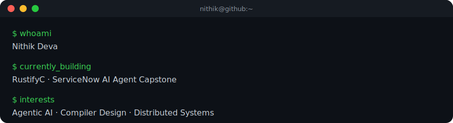
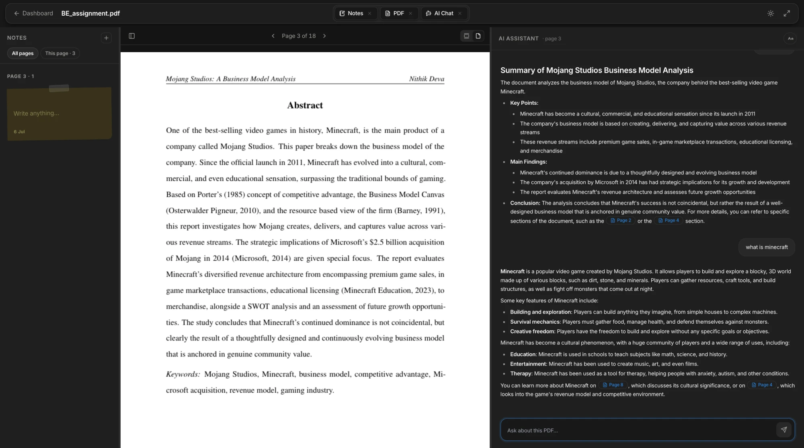
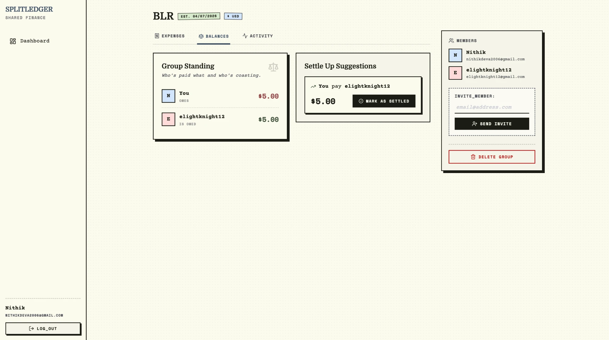
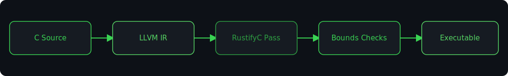

<h1 align="center">Nithik Deva</h1>

### About Me

Building AI-powered developer tools and full-stack platforms — from a from-scratch hybrid RAG pipeline to a compiler pass for memory-safe C. Also captain my college  swim team.

**Exploring:** Agentic AI · Compiler Design · Distributed Systems

### Highlights

-  Led NITW's Swim Team to 3rd overall, Inter-NIT Aquatics — Silver & Bronze (2025)
-  1 of 20 selected nationally for ServiceNow's **AI.Accelerate**
-  92% accuracy CV pipeline @ Eizen.ai (YOLO + LSTM)
-  600+ LeetCode problems solved
-  B.Tech CSE @ NIT Warangal — CGPA 8.54/10
-  Analyst @ 180 Degrees Consulting · Coordinator @ Innovation Garage

### Tech Stack

### Metrics

<!-- github-readme-stats.vercel.app (main stats + top-langs cards) has been down (503 DEPLOYMENT_PAUSED)
     for multiple days. Disabled below to avoid showing broken images — re-enable once it recovers,
     or point these at a self-hosted instance:

-->

<table align="center">
<tr>
<td width="50%"></td>
<td width="50%"></td>
</tr>
</table>

### Featured Projects

####  Folio — AI Study Assistant

Full-stack AI study platform with a resizable split-view workdesk, JWT-authenticated FastAPI backend, and a from-scratch hybrid RAG pipeline (no LangChain) that grounds every response in both current-page and globally-retrieved context. Streams responses over SSE using Gemini 2.0 Flash with a Groq Llama 3.3 70B fallback, and integrates PDF.js v4 for highlight-to-ask (Explain / Define / Summarise).

####  SplitLedger — Group Expense Splitting Platform

Indie-themed, Splitwise-style expense splitter where every balance is derived **live** from a 6-table relational ledger instead of stored — eliminating an entire class of balance-drift bugs. Runs a greedy minimum-transaction settlement algorithm that guarantees settlement in at most n−1 payments, with all money handled in integer cents. JWT auth (access + refresh, httpOnly cookies, bcrypt, silent refresh) backs an invitation-based membership system.

###  Currently Building

**RustifyC** — a compiler pass bringing Rust-like memory safety to C, implemented as an LLVM pass that inserts bounds checks at compile time.

Also deep in the build on an end-to-end **agentic AI capstone** for ServiceNow's AI.Accelerate — multi-agent orchestration over MCP, evaluated through LLM-as-judge rubrics and red-teaming.

### Connect

<!-- TODO: swap "#" for your live portfolio URL once it's up -->

<picture>
  <source media="(prefers-color-scheme: dark)" srcset="https://raw.githubusercontent.com/elightknight23/elightknight23/output/github-contribution-grid-snake-dark.svg" />
  <source media="(prefers-color-scheme: light)" srcset="https://raw.githubusercontent.com/elightknight23/elightknight23/output/github-contribution-grid-snake.svg" />
  
</picture>

